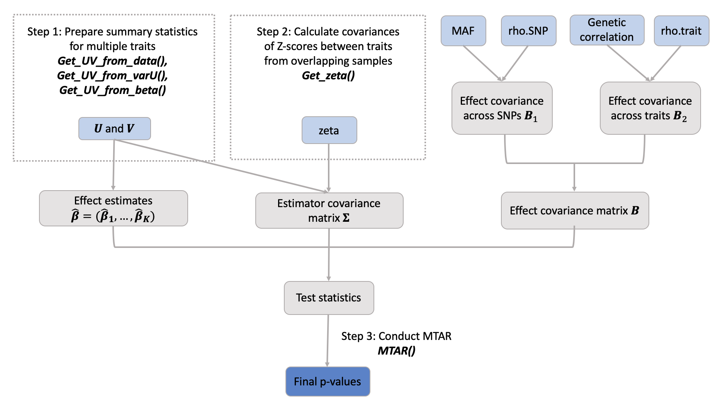
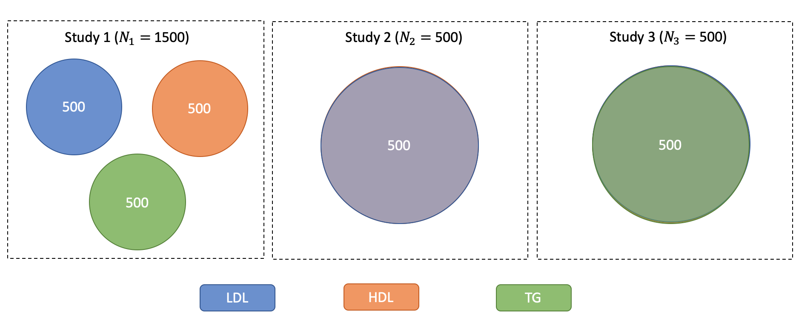

```{r setup, include=FALSE}
knitr::opts_chunk$set(echo = TRUE)
```

```{r load, echo=FALSE}
library(MTAR)
```

## Contents

- Overview
- System Requirements
- Installation Guide
- Demo
- URLs and References


## Overview 
MTAR package has functions to 1) compute the summary statistics with different types of data input; 2) to adjust summary statistics for sample overlap if necessary; and 3) to perform multi-trait rare-variant association tests using the summary statistics.

```{r, out.width = "650px", echo=FALSE, fig.cap="Fig 1: An overview of MTAR workflow. Light blue rectangle represents necessary input. Dark blue rectangle denotes the final output of MTAR function. Gray rectangle denotes the intermediate parameters."}

```

## System Requirements

The package development version is tested on the following systems:

Mac OSX: Mojave version 10.14.6 (R version 3.6.0)  

Windows 10 (R version 3.4.0)

The CRAN package should be compatible with Windows and Mac operating systems.

Before setting up the `MTAR` package, users should have `R` version 3.4.0 or higher. 

## Installing Guide
`MTAR` package requires R with version 3.4.0 or higher, which can be downloaded and installed from [CRAN](https://cran.r-project.org/). 

```
install.packages("MTAR")
```

### Package dependencies

`MTAR` package depends on several R packages (`MASS`, `CompQuadForm`, `Matrix`, `stats`, `utils`), which will be downloaded when installing `MTAR`. `MTAR` also uses non-exported R code from R packages `ACAT`, `SKAT` and `SeqMeta`. The `MTAR` package functions with all packages in their latest versions as they appear on `CRAN` on September 9, 2019. The versions of software are, specifically:
```
CompQuadForm_1.4.3
MASS_7.3-51.4
Matrix_1.2-17 
seqMeta_1.6.7
SKAT_1.3.2.1
```

## Demo

### Step 1: Prepare Summary Statistics for Multiple Traits
The score statistics $\mathbf{U}$ and their covariance matrix $\mathbf{V}$ are the summary statistics required by MTAR tests. In this section, we will demonstrate how to use various utility functions to prepare for these summary statistics. The output object of these utility functions can be directly taken by the MTAR function as input.

#### 1. Given the Individual-Level Data
Assume we are interested in effects of $m$ rare variants (MAF $<5$\%) in a gene or SNP-set on $K$ traits. For the $k$th trait, when the individual-level genotype $\mathbf{G}_{ik}$, covariate $\mathbf{X}_{ik}$ and trat data $Y_{ik}$ are available, the score statistics $\mathbf{U}_k$ and their covariance estimate $\mathbf{V}_{k}$ can be obtained from the generalized linear model with the likelihood function 
\[
\exp\left\{\frac{Y_{ik} \left(\mathbf{\beta}^{\rm T}_{k} \mathbf{G}_{ik}+ \mathbf{\gamma}^{\rm T}_{k} \mathbf{X}_{ik}\right)-
b(\mathbf{\beta}^{\rm T}_{k} \mathbf{G}_{ik}+ \mathbf{\gamma}^{\rm T}_{k} \mathbf{X}_{ik})}{a(\phi_k)}+c(Y_{ik},\phi_k)\right\},
\]
where $\mathbf{\beta}_k$ and $\mathbf{\gamma}_k$ are regression 
parameters, $\phi_k$ is a dispersion parameter, and $a$, $b$, and $c$ are specific functions. The first and second derivatives of $b$ are denoted by $b'$ and $b''$. Specifically, we have 
\begin{align*}
\mathbf{U}_k &= a(\widehat{\phi}_k)^{-1} \sum_{i = 1}^n \big\{Y_{ik} - b'(\widehat{\mathbf{\gamma}}_k^T\mathbf{X}_{ik})\big\} \mathbf{G}_{ik}\\
\mathbf{V}_k &=a(\widehat{\phi}_k)^{-1} \Big[\sum_{i=1}^n b''(\widehat{\mathbf{\gamma}}_k^T\mathbf{X}_{ik})\mathbf{G}_{ik}\mathbf{G}_{ik}^T - 
\Big\{\sum_{i = 1 }^n b''(\widehat{\mathbf{\gamma}}_k^T\mathbf{X}_{ik})\mathbf{G}_{ik}\mathbf{X}_{ik}^T\Big\} 
\Big\{\sum_{i = 1 }^n b''(\widehat{\mathbf{\gamma}}_k^T\mathbf{X}_{ik})\mathbf{X}_{ik}\mathbf{X}_{ik}^T\Big\}^{-1}
\Big\{\sum_{i = 1 }^n b''(\widehat{\mathbf{\gamma}}_k^T\mathbf{X}_{ik})\mathbf{X}_{ik}\mathbf{G}_{ik}^T\Big\}\Big]
\end{align*}

where $\widehat{\mathbf{\gamma}_k}$ and $\widehat{\phi}_k$ are the restricted maximum likelihood estimators of $\mathbf{\gamma}_k$ and $\phi_k$ under $H_0: \mathbf{\beta}_k = 0$. For the linear regression model, we have $a(\widehat{\phi}_k)  = n^{-1}\sum_{i = 1}^n(Y_{ik} - \widehat{\mathbf{\gamma}}_{k}^T\mathbf{X}_{ik})^2$, $b'(z) = z$ and $b''(z) = 1$. For the logistic regression model, we have $a(\phi) = 1, b'(z) = e^z/(1 + e^z), b''(z) = e^z/(1 + e^z)^2$ (@tang2015meta; @hu2013meta).
 
To calculate the summary statistics from individual-level data, *Get_UV_from_data* can be used with required inputs of *traits*, *covariates* and *genotype*. Specifically, *traits*, *covariates* and *genotype* are 3 lists and each sublist contains the information from $L$ study. For $\ell$th study, traits, covariates and genotype information should be a $n\times K$, $n\times D$ and $n\times m$ matrix, respectively. The number of traits in each study can be different, but the name of traits must be provided. Same as the name of SNPs in *genotype*. The missing value in *trait* or in *genotype* should be labeled as NA. The order of subject IDs in *traits*, *covariates* and *genotype* should be the same.

Here, we use a simulated dataset *rawdata* to show how to apply *Get_UV_from_data* function. In *rawdata*, there are 3 studies, 3 continuous traits and 10 rare variants. Fig. 2 shows the diagram for sample overlap among traits in three studies. Specifically, there are 1500 subjects in study1, but each subject only has one trait measurement. In study2 and study3, the sample size is 500 and each subject has two (LDL and HDL) or three traits (LDL, HDL and TG) measurements.

```{r, out.width = "500px", echo=FALSE, fig.cap="Fig 2: Venn  diagram of sample overlap among traits in three studies."}

```

```{r sumstats, eval=TRUE, message=FALSE}
data("rawdata")
attach(rawdata)
head(traits.dat$Study1)
head(cov.dat$Study1)
head(geno.dat$Study1)
obs.stat <- Get_UV_from_data(traits = traits.dat,
                         covariates = cov.dat,
                         genotype = geno.dat,
                         covariance = TRUE)
obs.stat$U
detach(rawdata)
```

For each trait, if the number of unique values is no more than 2, then this trait will be viewes as a binary trait and a logistic regression will be conducted to calculate the summary statistics. If *covariance = TRUE*, then a $m\times m$ covariance matrix $\mathbf{V}_k$ is returned, otherwise only $m$ diagonal elements ${\rm diag}(\mathbf{V}_k)$ is returned.

#### 2. Given Score Statistics and their Variance
When the score statistics $\mathbf{U}_k$ and their variance (${\rm  diag}(\mathbf{V}_k)$) are available, the covariance matrix $\mathbf{V}_{k}$ can be approximated as
\[
\mathbf{V}_k \approx {\rm diag}(\mathbf{V}_k)^{1/2} \mathbf{R} {\rm diag}(\mathbf{V}_k)^{1/2},
\]
where $\mathbf{R}=\{R_{j\ell}\}_{j,\ell=1}^m$ is the SNP correlation matrix estimated either from the working genotypes or the external reference (@hu2013meta). This transformation has been implemented in function *Get_UV_from_varU*.

```{r cMTAR_Vse,eval = TRUE, message=FALSE}
data("varU.example")
attach(varU.example)
obs.stat <- Get_UV_from_varU(U = U, varU = varU, R= R)
obs.stat$U
detach(varU.example)
```

#### 3. Given Genetic Effect Estimates and their Standard Errors
When the genetic effect estimates $\widehat{\mathbf{\beta}}_{k} = \{\widehat{\beta}_{kj} \}_{j=1}^m$ and their standard error $\mathbf{se}_{k}= \{ se_{kj}\}_{j=1}^m$ are available, we can approximate $\mathbf{U}_k = \{ U_{kj}\}_{j=1}^m$ and $\mathbf{V}_{k} = \{V_{kj\ell}\}_{j,\ell=1}^m$ as ${U}_{kj} \approx \widehat{\beta}_{kj}/se^2_{kj}$ and $V_{kj\ell} \approx R_{j\ell} /(se_{kj}se_{k\ell})$ via function *Get_UV_from_beta*.

```{r Beta, eval=TRUE}
data("beta.example")
attach(beta.example)
obs.stat <- Get_UV_from_beta(Beta = Beta, Beta.se = Beta.se, R = R)
detach(beta.example)
```

It took less than 0.05 second to calculate the summary statistics for a gene with 10 rare variants.

### Step 2. Calculate Covariances of Z-scores between Traits from Overlapping Samples
If all the traits are from one study or from multiple studies with overlapping subjects, the genetic effect estimates among traits are correlated. To calculate the covariances of these genetic effects, we need to first compute *zeta* -- the among-trait covariances of Z-scores for the SNPs that are not associated with the traits (details in @luo2019mtar). In function *Get_zeta*, we ask users to input a vector of Z-scores from genome-wide association tests between common variants and each trait. The function will conduct LD pruning (by using the reference independent SNP list in 1000 Genome), remove SNPs with p-value < 0.05 (default p-value cutoff threshold), and compute *zeta*. 

Here we showed a simplified example of estimating matrix *zeta*, we extracted a subset of 737 null and common SNPs from chromosome 1 in the Global Lipids Genetics Consortium (GLGC, @liu2017exome). After filtering out those dependent SNPs, there are only 137 SNPs remaining. The computation time of estimating *zeta* with 737 null and common SNPs is less than 4 seconds.

```{r zeta, eval=FALSE}
data("zeta.example")
attach(zeta.example)
# Downloading independent common SNPs from 1000Genome data set.
githubURL <- "https://github.com/lan/MTAR/blob/master/indp_snps.1KG.rda?raw=true"
utils::download.file(githubURL,"1kgfile")
load("1kgfile")
zeta1 <- Get_zeta(Zscore = Zscore, Indp_common_snp = indp_snps.1KG)
detach(zeta.example)
```

### Step 3. Run Multi-Traits Rare-Variant Association Tests (MTAR)
To run MTAR function, the score statistics *U*, their covariance matrix *V* and minor allele frequency *MAF* are required. Other inputs are optional. Here an example dataset (*MTAR.example*) offers all the information needed in *MTAR* function.

```{r MTAR}
data("MTAR.example")
names(MTAR.example)
```

Specifically, *genetic_cor.trait* represents the genetic correlation information (@Bulik2015). The genetic correlation can be estimated using *ldsc* software (@bulik2015ld and URLs). Some websites also archive the genetic correlation among many complex traits (URLs). If no genetic correlation is available, *MTAR* will use an exchangeable correlation structure among traits. The *zeta* can be estimated in Step 2 and via *Get_zeta*. If no *zeta* is provided, *MTAR* assumes there is no sample overlap among traits. The p-values of MTAR-O, cMTAR, iMTAR and cctP and ancillary information will be returned. In this example, it took less 5 seconds to calculate the MTAR test p-values for gene PNPLA2.

```{r cMTAR, warning=FALSE, message=FALSE, eval = TRUE}
attach(MTAR.example)
pval <-  MTAR(U = U, V = V, MAF = MAF, genetic_cor.trait = genetic_cor.trait, zeta = zeta)
pval
detach(MTAR.example)
```

## URLs
ldsc website: https://github.com/bulik/ldsc/wiki/Heritability-and-Genetic-Correlation
Genetic correlation: https://media.nature.com/original/nature-assets/ng/journal/v47/n11/extref/ng.3406-S2.csv

## References
